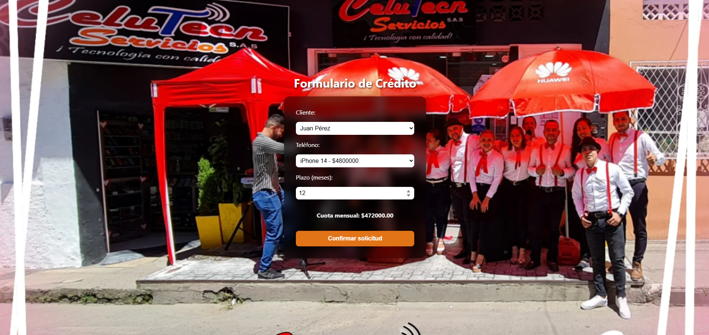

# FinanciaCel

Aplicación web para la gestión de créditos de celulares, desarrollada como parte de una prueba técnica. Permite simular, aprobar y registrar créditos, gestionando clientes, teléfonos y cuotas mensuales.

## Tecnologías utilizadas

- **Backend:** Laravel 12.0
- **Frontend:** HTML, CSS y JavaScript Vanilla
- **Base de datos:** MySQL

## Funcionalidades

- Listado de clientes y teléfonos desde el backend
- Simulación de crédito con interés del 1.5% mensual
- Validación de existencia de stock y crédito activo
- Aprobación de crédito con generación de cuotas
- Descuento automático de stock
- Estilo moderno con fondo personalizado y efecto blur

## Captura



## Instalación y ejecución
1. Clona el repositorio:
``` bash
git clone https://github.com/DiegoCodess/financia-cel.git
cd financia-cel
```
2. Instalación de dependencias:
``` bash
composer install
```
3. Configura .env:
``` bash
cp .env.example .env
php artisan key:generate
```
4. Crea un archivo para SQLite
``` bash
touch database/database.sqlite
```
5. Corre migraciones:
``` bash
php artisan migrate --seed
```
6. Inicia el servidor:
``` bash
php artisan serve
```
7. Abre en tu navegador con el host que te da el servidor. ejemplo:
``` bash
http://127.0.0.1:8000/
```

---
Agrazco de corazón su consideración y espero les guste. **Bendiciones**.


  **ING.** Diego Fernando Cortes Rojas 

---